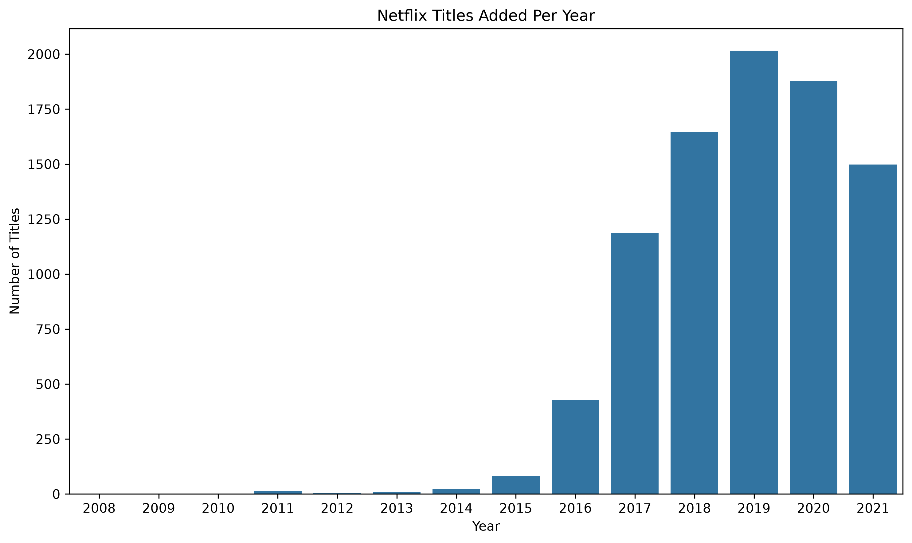
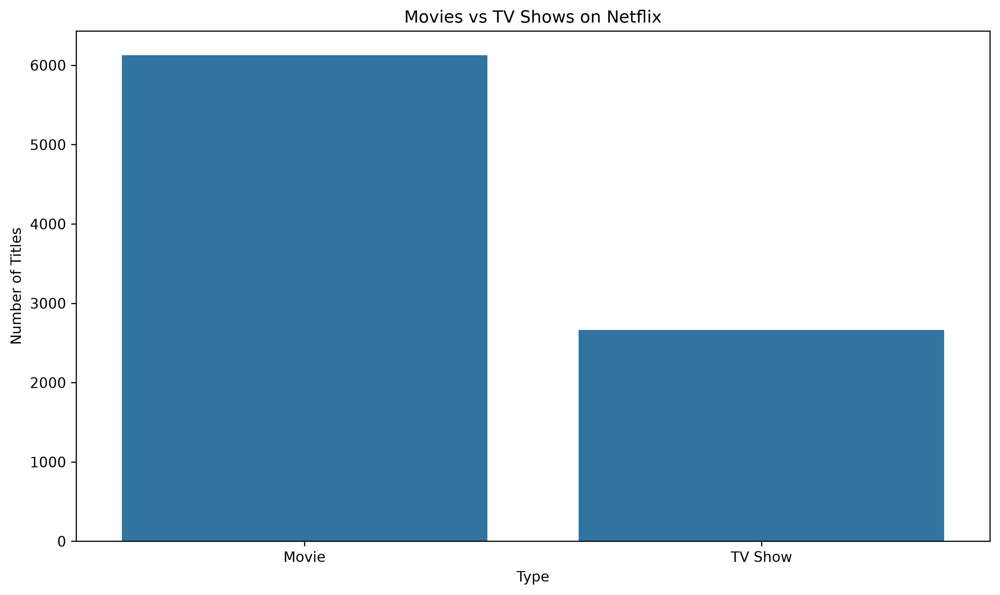
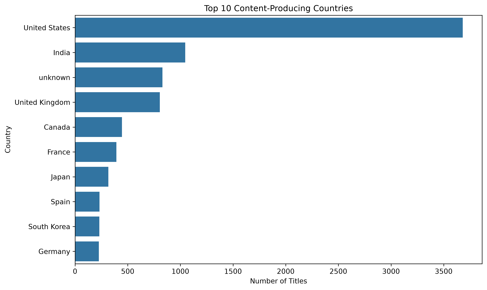
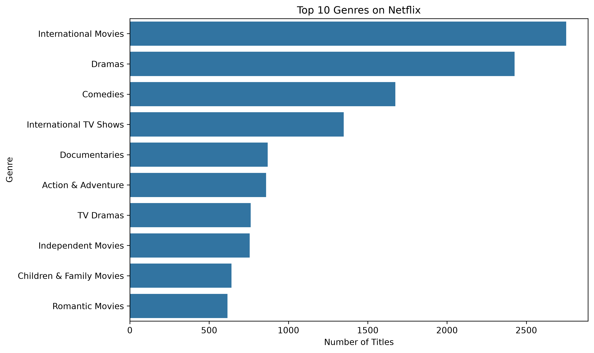

# Netflix Data Analysis

**Business question:** Has Netflix's content strategy shifted as its catalog has grown, and if so, toward what? This project explores a Netflix Movies and TV Shows dataset from Kaggle to answer that, while practicing data cleaning, transformation, and visualization with pandas, matplotlib, and seaborn.

## Key Insights
- Titles added peaked in 2019, likely reflecting Netflix's rapid content expansion before production slowed in the years that followed.
- Movies make up a much larger share of the catalog than TV Shows — a volume strategy rather than a depth one.
- The United States has the most titles by far, followed by India and the United Kingdom, showing where content investment has concentrated.
- "International Movies" is the most common genre tag, pointing to a deliberate push toward globally available content rather than a single home market.

## What I Did

**Cleaning:**
- Handled missing values — filled some with `"Unknown"`, dropped rows with very few nulls.
- Removed duplicates and converted `date_added` to a proper datetime format.
- Split multi-value columns (`country` and `listed_in`) so each value could be counted individually instead of grouped together as one string.

**Analysis — questions explored:**
- How has the number of titles added to Netflix changed over the years?
- What's the split between Movies and TV Shows?
- Which countries produce the most content?
- What are the most and least common genres?

## Visualizations

### Titles Added Per Year

Shows how Netflix's catalog grew over time, with the highest number of titles added in 2019.

### Movies vs TV Shows

Compares the distribution of Movies and TV Shows in the Netflix catalog.

### Top 10 Content-Producing Countries

Displays the countries that contributed the most titles to the Netflix catalog.

### Most Common Genres

Shows the most common genres after splitting titles with multiple genre labels.

## Tools
- Python
- pandas
- matplotlib
- seaborn
- Jupyter Notebook

## Dataset
`netflix_titles.csv` is included in this repository.
Original dataset: [Netflix Movies and TV Shows on Kaggle](https://www.kaggle.com/datasets/shivamb/netflix-shows)

## Author
Aya — MIS Student, Lebanese University
